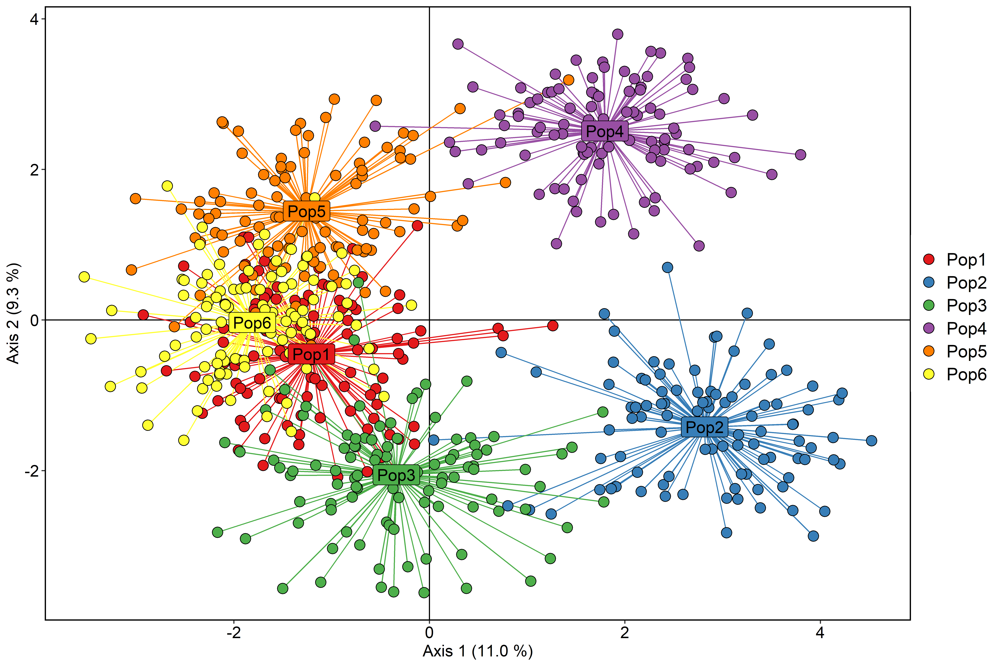
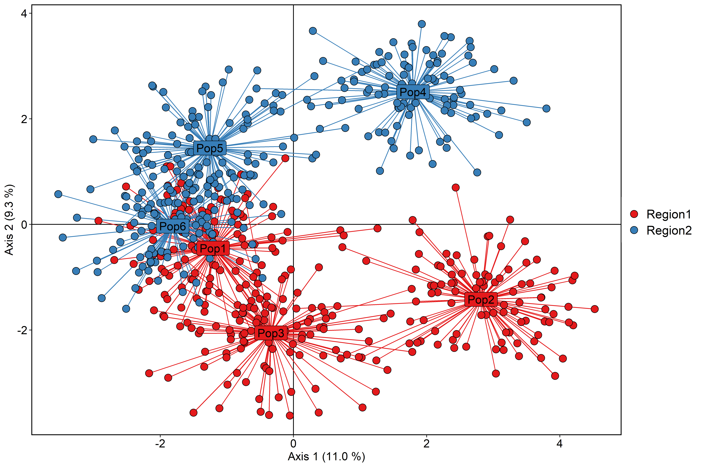

# R code for population genetics analysis
A collection of scripts that have been useful for population genetics analysis in R.

### Example figures

PCA coloured by population

PCA coloured by region

Gene flow diagrams

